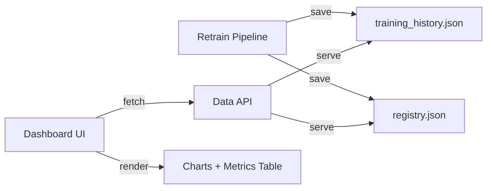

# Model Monitoring Dashboard

Thêm trang **Model Monitor** vào hệ thống dashboard hiện tại, cho phép xem training history (train/val loss curves) và metrics đánh giá chất lượng model qua các phiên training.

## Tổng quan thiết kế

Hệ thống gồm 3 phần:



## Proposed Changes

### 1. Backend — Lưu Training History

#### [MODIFY] [retrain_pipeline.py](file:///c:/Users/ASUS/Study/ts/src/training/retrain_pipeline.py)

- Sau khi train LSTM, lưu epoch-level history (`loss`, `val_loss`, `mae`, `val_mae`) ra file `models/training_history.json`
- Mỗi lần train mới, append thêm entry với `version_tag` và `timestamp`
- Format:
```json
[
  {
    "version": "v_2026-05-01",
    "trained_at": "2026-05-01T04:04:53",
    "lstm_hourly": {
      "loss": [0.05, 0.03, ...],
      "val_loss": [0.06, 0.04, ...],
      "mae": [3.2, 2.8, ...],
      "val_mae": [3.5, 3.0, ...]
    },
    "lstm_daily": { ... }
  }
]
```

---

### 2. Backend — API Endpoint

#### [MODIFY] [main.py](file:///c:/Users/ASUS/Study/ts/services/data_api/main.py)

Thêm 2 endpoint:

- `GET /model/registry` — Trả về `registry.json` (metrics qua các version)
- `GET /model/history` — Trả về `training_history.json` (epoch-level curves)

---

### 3. Frontend — Model Monitor Page

#### [MODIFY] [index.html](file:///c:/Users/ASUS/Study/ts/services/dashboard_ui/index.html)

- Thêm nav item **"Model Monitor"** vào sidebar (icon: `monitoring`)
- Thêm section `#modelMonitorSection` ẩn/hiện khi click nav

#### [MODIFY] [script.js](file:///c:/Users/ASUS/Study/ts/services/dashboard_ui/script.js)

Thêm logic:
- **Training Loss Chart**: Line chart (Chart.js) hiển thị `loss` vs `val_loss` per epoch cho LSTM hourly/daily
- **Metrics Comparison Table**: Bảng so sánh MAE/RMSE/MAPE giữa các version (từ registry)
- **Version Selector**: Dropdown chọn version training để xem
- **Model Status Cards**: Hiển thị current active version, decision (accept/rollback), trained_at

---

## UI Layout

```
┌─────────────────────────────────────────────────────┐
│  📊 Model Monitor                                   │
├─────────────────────────────────────────────────────┤
│  [Version: v_2026-05-01 ▼]     Status: ✅ Active    │
├──────────────────────┬──────────────────────────────┤
│  LSTM Hourly         │  LSTM Daily                  │
│  ┌────────────────┐  │  ┌────────────────┐          │
│  │ Loss vs ValLoss│  │  │ Loss vs ValLoss│          │
│  │  (line chart)  │  │  │  (line chart)  │          │
│  └────────────────┘  │  └────────────────┘          │
├──────────────────────┴──────────────────────────────┤
│  📋 Metrics Comparison (all versions)               │
│  ┌──────────────────────────────────────────────┐   │
│  │ Version  │ Prophet MAE │ LSTM MAE │ Decision  │   │
│  │ v_05-01  │ 5.07°C      │ 1.36°C  │ ✅ accept │   │
│  │ v_04-30  │ 6.19°C      │ 2.48°C  │ ❌ reject │   │
│  │ v_04-29  │ 7.62°C      │ 1.44°C  │ ✅ accept │   │
│  └──────────────────────────────────────────────┘   │
├─────────────────────────────────────────────────────┤
│  📊 Per-City Prophet Metrics (bar chart)            │
│  ┌──────────────────────────────────────────────┐   │
│  │  MAE by city (grouped bar: hourly vs daily)  │   │
│  └──────────────────────────────────────────────┘   │
└─────────────────────────────────────────────────────┘
```

## Verification Plan

### Automated Tests
- Chạy `pytest tests/` — đảm bảo không break existing tests
- Gọi `GET /model/registry` và `GET /model/history` — verify JSON response

### Manual Verification
- Mở Dashboard → click "Model Monitor" → verify charts render đúng
- So sánh dữ liệu chart với `registry.json` raw
